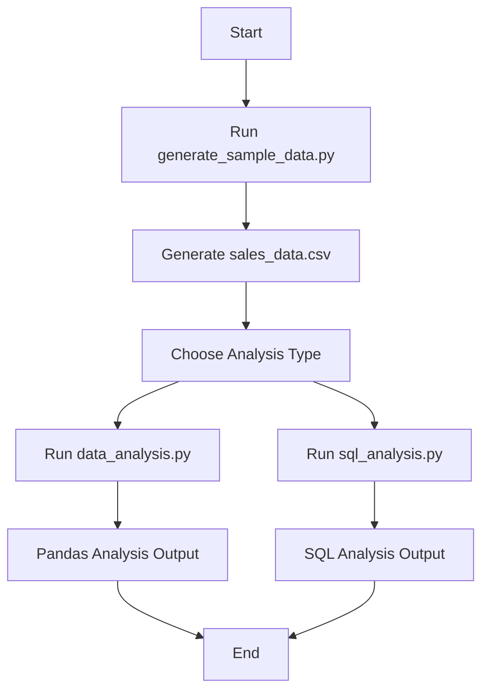
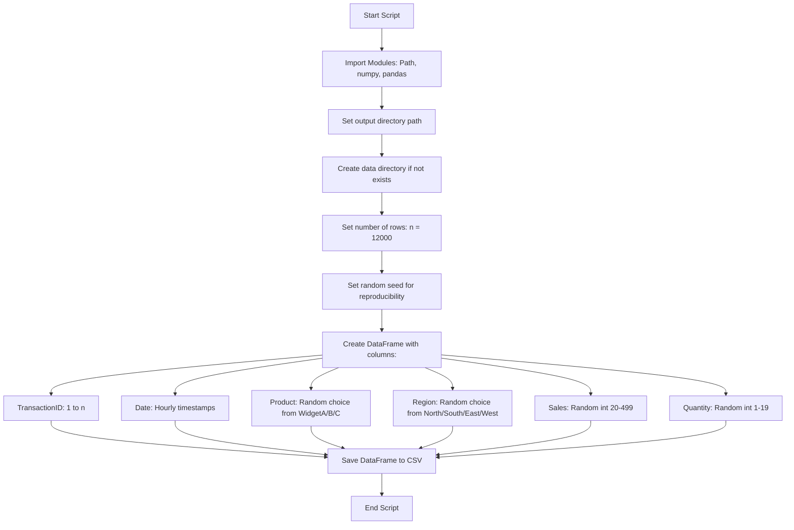
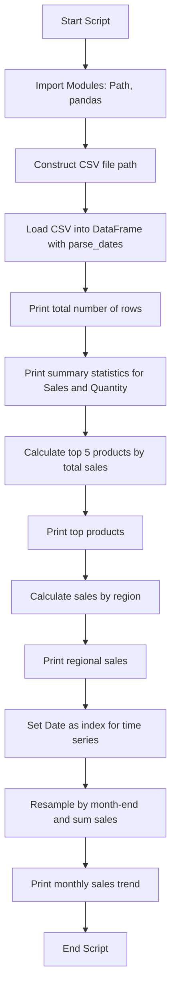
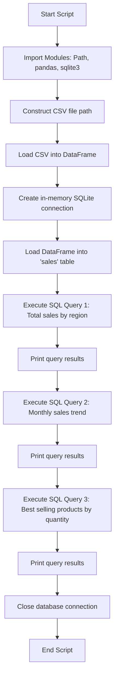
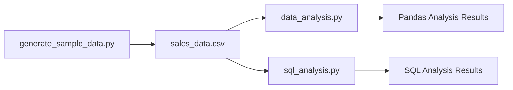
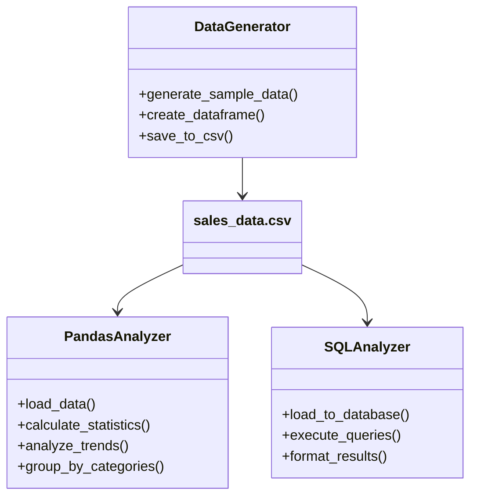

# Project Diagrams

This document contains flowcharts and design diagrams for the Business Data Analysis Project.

## Overall Project Workflow

## Data Generation Flow (generate_sample_data.py)

## Pandas Data Analysis Flow (data_analysis.py)

## SQL Analysis Flow (sql_analysis.py)

## Data Flow Diagram

## Class Diagram (Simplified)

